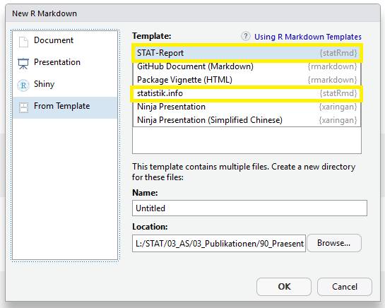

class: inverse, center, middle

# The state of corporate design @ STAT ZH

???

This presentation is about 'mastering CD'. However by mastering CD i do not mean perfectly layout and format everything and investing a lot of resources to do so. It is about achieving visual consistence of different forms of publications by letting R do the job for you. We will present the functions & templates we have programmed in R that users will not use for the sake of complying with CD at any cost but for CONVENIENCE.

---
class: middle, left

#The state of CD @ <font color=#009ee0>STAT ZH</font>

- Generic CD Guidelines for cantonal public administration cover the basics (e.g. fonts)
- No centralized publishing, several self-publishers
 - Infographics (Website & Twitter), Excel-Tables, statistik.info
 
- professionaly layouted publications are the exception

- How do we achieve <b>visual uniformity</b> of our products?

--

- <b>'Do it yourself' Corporate Design Toolbox</b>


???

The generic CD Guidelines provide a plenty of freedoms when it comes to design  - especially to units that publish data-products. We at the statistical Office have no centralized publishing. We are a group of self-publishers that produce infographics, Excel-tables and pdf-publications. So given this situation, how do we achieve a high degree of visual unifomirty? We are building a Corporate Desing Toolbox for this purpouse.


---
class: middle, left

# Corporate-Design Toolbox

__[statR](https://statistikzh.github.io/statR/)__

- Colors for R-graphics <font color=#009ee0>zhpal</font>

- Theme for ggplot2 graphics <font color=#009ee0>theme_stat</font>

- Write data in formated Excel-Tables <font color=#009ee0>statXLSX</font>

__[statRmd](https://github.com/statistikZH/statRmd)__

- Reports & pdf documents <font color=#009ee0>statRmd</font>

---
class: inverse, center, middle

# ZH Colour Palette

---
class: center, middle

Not the ideal <font color=#009ee0>color-palette</font> for graphs.
```{r tidy=FALSE,echo=FALSE}
library(scales)
library(ggplot2)
library(statR)

ggplot(diamonds, aes(clarity, fill=clarity))+ 
  geom_bar(position = "stack", width = 1)+
  scale_fill_manual(values=zhpal$zhcd)

```


???
The official cantonal CD-colors were made for other purpouses than data-visualization - mainly for the use in print publications produced with office products. Which explains why the palette is like it is.
---
background-image: url(libs/gross.gif)
background-position: 50% 40%
background-size: 70%
class: center, bottom


.footnote[[Via Giphy](https://media.giphy.com/media/tjwzClJM6fyEw/giphy.gif)]

---
### How we created our own color-scheme

- **Color palette creation** with R
 - Mute the cd colors (color interpolation)
 - Adapt the color space (LAB instead of RGB)
 - Creation of a color-matrix (varying hue AND saturation)
 - Testing for Colorblind-friendliness
 
## Resources
 
**Interpolation** → grDevices::colorRampPalette()

**Colorblind-Testing** → [Dichromat-package](https://cran.r-project.org/web/packages/dichromat/index.html)

???

Everyone was using his own palettes (mainly color brewer) - no consistence! So we decided to develop our own color scheme. Here you can see the steps of the color-sheme developemnt. We took the cd-colors, reorderer and muted them. Of course, we've adapted the colorspace to LAB instead of RGB. LAB is a color space that is optimized for the human eye better percevieng the different hues. Then i wrote a function on top of the colorRampPalette-Function that you can feed with a palette and it produces differently saturated (lighter and darker) versions of it, in equal steps. The result is a color matrix which you can see on the next slide. 

---
class: center,middle

```{r tidy=FALSE,echo=FALSE}
library(statR)
library(scales)

show_col(c(zhpal$zhdarker,zhpal$zhdark,zhpal$zh,zhpal$zhlight,zhpal$zhpastel,zhpal$zhextralight,zhpal$zhultralight), borders=FALSE)
```


---
class: center,middle


.pull-left[
```{r tidy=FALSE,echo=TRUE}
p = ggplot(diamonds, aes(clarity, fill=cut)) + 
  geom_bar(position = "stack", width= 0.5)

p +theme_stat() +
  scale_fill_manual(values=zhpal$zhdiagonal)
```
]

.pull-right[
```{r tidy=FALSE,echo=TRUE}
library(dichromat)

p +theme_stat() +
  scale_fill_manual(values=dichromat(zhpal$zhdiagonal,type=c("tritan")))
```
]

???
If you should ever create your own palette you will have it tested for colorblindness.
The dichromat package is a great resource. You can see an example here.

---
class: inverse, center, bottom

# theme_stat()

## <br>a theme for ggplot2 graphics

<br>
.right[
]

???
the second element in our toolbox is a ggplot2-theme. As with the colours - before everyone was playing around with theme options and you would reckognize who did a chart by how it looked.


---
class:top, left

# Graphics with <font color=#009ee0>theme_stat()</font>

```{r, eval = T, echo = F, include = F}
library(ggplot2)
library(statRmd)
library(dplyr)
library(formatR)
library(gridExtra)
source("L:/STAT/03_AS/01_Werkzeuge/01_Toolbox/R/Funktionen/theme_stat_tex.r")
source("L:/STAT/03_AS/01_Werkzeuge/01_Toolbox/R/Funktionen/theme_stat.r")
```


.pull-left[
```{r, eval = F, echo = T, fig.height=5, fig.width=7, fig.align='center'}

ggplot(mtcars, 
       aes(x = factor(cyl), 
           fill = factor(cyl)))+
geom_bar()


```
<br>
```{r, eval = T, echo = F, fig.height=4.55, fig.width=5, fig.align='center'}

ggplot(mtcars, 
       aes(x = factor(cyl),
           fill = factor(cyl)))+
geom_bar()

```

]

--

.pull-right[
```{r, eval = F, echo = T, tidy=T, tidy.opts=list(blank=FALSE, width.cutoff=30)}

ggplot(mtcars, 
       aes(x = factor(cyl),
           fill = factor(cyl)))+
geom_bar()+
*theme_stat()

```

```{r, eval = T, echo = F, fig.height=4.5, fig.width=5, fig.align='center'}

ggplot(mtcars, aes(x = factor(cyl), 
                   fill = factor(cyl)))+
geom_bar()+
theme_stat()+
scale_fill_manual(values = zhpal$zhbygseq, name = NULL)+
labs(y = NULL, x = NULL)

```
]


???
we specify font, default colors and many arguments within theme, such as  axes (lines, breaks, ticks), panel,grid, legend.position, background-color

---

class: inverse, center, middle

# Producing already formated XLSX-tables with R


???

I would never have imagined to give a presentation related to EXCEL at an R-conference. But here i am. I will try to make it short. We're in this toghether and will survive it for sure. Just think about the lunch break soon. 
However i have to admit that it appears to be possible to do crazy stuff in Excel - i mean look at this gif that i found on reddit. Someone has programemd this in excel!

---
background-image: url(libs/turtles.gif)
background-position: 50% 10%
background-size: 80%
class: center, bottom, inverse

## Our users love Excel-tables
100+ Excel-tables on our website<br>
Data is delivered in Excel-tables to users on a daily-basis<br>
No strict guidelines on how XLSX files should look like

.footnote[[<font color=#FFFFFF>Gif: Hoguemr, reddit<font>](https://www.reddit.com/r/funny/comments/1gzksk/work_was_a_little_slow_for_me_this_morning_again/)]

???

The majority of our customers relies on Excel as a tool for data analysis. Thats why we have 100+ excel Tables on our website. We perform customer specific queries on a daily basis and deliver the data in Excel-tables. However there is a problem with this - for a long time, there haven't been any strict guidelines on how our XLSX Files should look like.

Be warned the next slide -> headache. How diverse our excels looked like (and to some degree still do)

---
background-image: url(libs/excel.gif)
background-size: contain
class: center, bottom

???

you can see the prob there
---

#statXLSX

Creating formated excel-tables straight-out-of-R saves time and reduces the risk of errors. We recurred to the [***openxlsx-package***](https://cran.r-project.org/web/packages/openxlsx/openxlsx.pdf) package to define functions that write R-datasets in formated STAT ZH-Excel-tables.

***single worksheet***
statR::quickXLSX(data,"name of the table")

***multiple worksheets***
statR::splitXLSX(data,"name of the table", sheetvar)

***Advantages***

+End-to-end reproducibility

+quality assurance, less error prone

+visual coherence

???
The amount of time i spend with formatting excel-tables at work is directly correlated with job-dissatisfaction. i love my job. And to assure that this stays as it is i wrote these functions. There are several packages that allow to create xlsx files. I choose to build the functions on top of the openxlsx package. openxlsx does not dependend on Java, which has caused me trouble when using other excel-packages. 

We are automatizing the Excel-production and the functions are coming into play in this process. 

---
background-image: url("libs/5.PNG")
background-size: contain
class: center, bottom

---
background-image: url("libs/6.PNG")
background-size: contain
class: center, bottom


---
class: inverse, center, bottom

# statRmd

## <br>RMarkdown pdf templates

<br>
.right[
]
---

class: left, top


# Our Analytical Publications

### PDF publications (mainly online)


.pull-left[
[<b> statistik.info</b>](https://statistik.zh.ch/internet/justiz_inneres/statistik/de/themen/statistikinfo.html)
- custom made
- stand-alone 
- single-authored projects
- text-intensive

.center[]


]

.pull-right[
<font color=#009ee0><b>Periodic reports</b></font>
- highly automated
- parameterized
- «reproducible»
- mainly charts and tables

.center[]
]


---

class: top, left

# Workflow

### Before
- Analysis in various .r files
- Produce graphics with R and save as .png
- Include .png in Word template
- Publish Word as PDF

--

### Today
We've established an analysis and publication process, that is (more):
- traceable
- «reproducible»
- allows publication of high quality charts and maps
- in accordance with our corporate design

--

.large[<font color=#009ee0>➡ RMarkdown</font>]

???
Markdown is a lightweight markup language with plain text formatting syntax. It is designed so that it can be converted to HTML and many other formats using a tool by the same name.set up a RMarkdown file in RStudio render it with some tex-compiler through kniter and get the pdf. How can you custommize your pdf output? -> YAML header

---
class: left, top

#  RMarkdown pdf output


.pull-left[
### Default
```{r, eval = F, echo = T, tidy=T, tidy.opts=list(blank=FALSE, width.cutoff=30)}
---
title: "Title"
author: "Name"
output:
*  pdf_document
---
```

.center[]

]
--

.pull-right[
###statRmd::stat_report
```{r, eval = F, echo = T, tidy=T, tidy.opts=list(blank=FALSE, width.cutoff=30)}
---
title: "Haupttitel"
author: "Vorname Nachname"
output:
*  statRmd::stat_report
---
```
.center[]
]

???
let's get a bit deeper in the technical details. we see here a yaml header of a random RMarkdown file. In the yaml header you define your output type, pdf, html, word, whatever. according to the output section this file is going to produce a PDF document. furthermore, we have specified a latex_engine xelatex (necessary for arial fonts) and a cairo_pdf device for the graphics output. probably, we wish to make further adjustments to the output. we have (at least) 2 ways of making further customizations. Probably you may want do make adjustments to the default .tex layout. like font, colors, title page etc. 2 ways of doing this: 
- in the header-includes: you can do the tex-adjustments, loading packages, define colors etc.
- you create you own my_template.tex and overwrite rmarkdowns default .tex file 

statRmd is, as you have seen, a package containing templates and helper functions  (for example to nicely align the graphics output in the document or to nicely wrap plot titles ). I'll just show how it works.

---
class: left, top


# Load Template from <font color=#009ee0>statRmd</font>


File > New File > R Markdown > From Template


---
class: left, top

###  Examples

**statistik.info**

- [Schnell, Andrea 2018, statistik.info 2018/02, Wertschöpfung und
Produktivität](https://statistik.zh.ch/dam/justiz_innern/statistik/Publikationen/statistik_info/si_2018_02_wertschoepfung.pdf.spooler.download.1525771630192.pdf/si_2018_02_wertschoepfung.pdf)

**Periodic Reports**

- [Quartalsbericht Handänderungsstatistik, Q1 2018](https://statistik.zh.ch/dam/justiz_innern/statistik/Themen/Immobilien_und_Raum/immomarkt_qbericht/Quartalsreport_2018_01.pdf.spooler.download.1532351614892.pdf/Quartalsreport_2018_01.pdf)


---
class: left, top

#  Conclusion

__What we have achieved with our CD-Toolbox__
 
- drastic reduction of time spent for repetitive tasks

- setting of CD-standards through convenience (not by 'force'!)

- end-to-end reproducibilty of the resulting outputs

- gained experience that will help us setting up similar tools & templates for further products / publication channels (e.g. html-pages / shiny-apps)


???

So to draw a conclusion : what have we achieved with our CD-Toolbox? 

We've drastically reduced the time we used to invest in formatting single charts, excel-tables and pdf publications. Also we've factually achieved a much higher degree of visual coherence across our publications - without putting on pressure on people or forcing someone. Just by providing convenient tools! In the areas where the toolbox is at work, we've achieved end - to end reproducibility as well as repeatability. Just execute the code and get the same report again / same excel table with new numbers etc. And last but not least: we've gained experience in creating tools & templates, useful when we will create some for new products / publication channels. 

---
background-image: url("libs/sticker-01.png")
background-position: bottom right
background-size:30%

# Keep in touch

<br/>

__Slides__: https://bit.ly/2OezDo5

statR-package (colors, ggplot2-theme and xlsx-templates)  
https://github.com/statistikZH/statR

statRmd-package (templates for pdf-publications)  
https://github.com/statistikZH/statRmd

Website  
https://statistik.zh.ch

Email  
[thomas.lorusso@statistik.ji.zh.ch](mailto:thomas.lorusso@statistik.ji.zh.ch)

Twitter  
<a href="https://twitter.com/statistik_zh?ref_src=twsrc%5Etfw" class="twitter-follow-button" data-show-count="false">@statistik_zh</a><script async src="https://platform.twitter.com/widgets.js" charset="utf-8"></script>
<a href="https://twitter.com/@thlorusso?ref_src=twsrc%5Etfw" class="twitter-follow-button" data-show-count="false">@thlorusso</a><script async src="https://platform.twitter.com/widgets.js" charset="utf-8"></script>
<a href="https://twitter.com/@schnllr?ref_src=twsrc%5Etfw" class="twitter-follow-button" data-show-count="false">@schnllr</a><script async src="https://platform.twitter.com/widgets.js" charset="utf-8"></script>


<!-- .right[] -->
